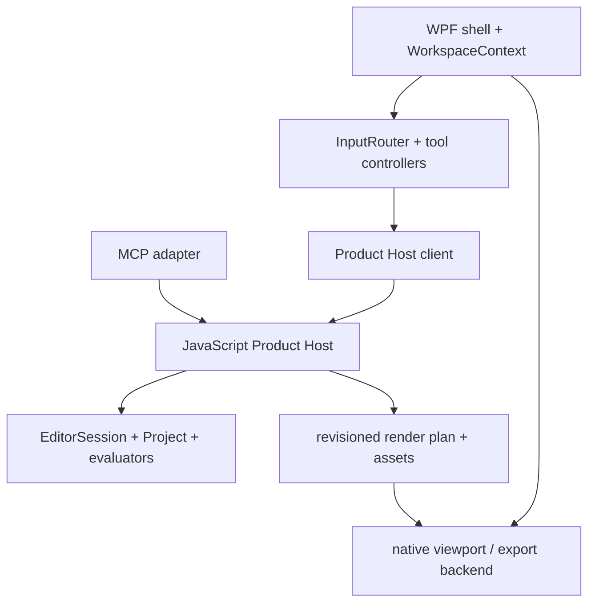
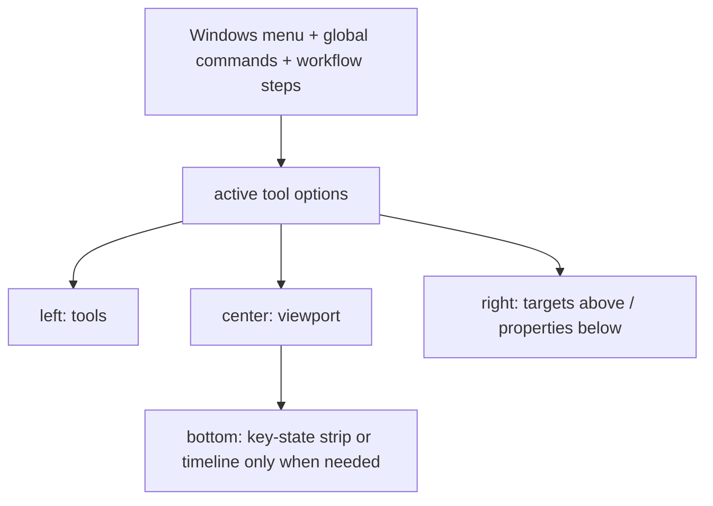

# C# / WPF editor shell migration design

Status: proposed for Issue #92  
Baseline audited: `main` at `2d9dd7cc5ec2fd67f845a34a1a692ce07387346d`  
Decision record: [`decisions/0006-csharp-wpf-shell-product-host.md`](decisions/0006-csharp-wpf-shell-product-host.md)

## 1. Purpose and decision summary

FLAMORIS 2D will replace its Electron/DOM editor shell with a Japanese-first C#/.NET WPF desktop shell. The migration is a shell, viewport, input, and authoring-UX replacement; it is not a file-for-file translation of the JavaScript product.

The existing JavaScript Project model, validation, typed Query/Command/Transaction layer, `EditorSession` history, import/migration rules, deterministic evaluation, and MCP schemas remain the Product authority during migration. A versioned, local Product Host boundary exposes that authority to the WPF client. A native viewport and compositor are ported deliberately against the existing `EvaluatedFrame` / render-plan contracts. Electron remains the released shell until the retirement criteria in this document pass.

This preserves the central invariant:

```text
human gesture or MCP request
  -> typed Product Command/Transaction
  -> one authoritative EditorSession
  -> Project/history
```

No C# project model, second undo stack, viewport-only persistent mesh, or MCP-only mutation path is introduced.

## 2. Audit scope and evidence

The audit compared:

- `AGENTS.md`, the current documentation index, basic design, roadmap, MCP design, and repository boundaries;
- ADR 0003 (Mesh Layout versus Deform), ADR 0004 (project/recovery), and ADR 0005 (Electron Windows shell);
- Issues #39, #88, and #90 plus the Issue #90 audit on current `main`;
- the Electron Main/preload boundary, `app.js`, HTML/CSS shell, workflow projection, scene/mesh/rig/timeline controllers, viewport input and overlays;
- Project schema v15, validation/migration, `EditorSession`, queries, render/evaluation/export boundaries, and the headless MCP adapter; and
- the current Cutwork WPF shell and production architecture as a sibling-product UX reference.

The audit found a healthy separation in the lower layers and an overly concentrated browser bootstrap at the top. `product/src/app.js` currently coordinates document lifecycle, workflow, selection, controller choice, viewport synchronization, recovery, and rendering. UI controllers generally respect Command/Query authority, but several also own transient gesture previews and selection. `workflow-modes.js` is correctly transient, while the DOM projection and CSS cascade remain fragile. `viewport-input-controller.js` combines routing for object, mesh, deformer, bone, weight, form-correction, IK, camera, drag/drop, and keyboard modifiers. That is the primary migration seam.

Issue #90 is important evidence: the mature `MeshTopology` / `MeshKeyform` and history contracts survived, while legacy `state.mesh` and workflow projection made the production UI appear to have a second mesh truth. The WPF design must remove that ambiguity rather than recreate it.

Cutwork demonstrates the desired family resemblance: conventional Windows menu and toolbar, a compact left tool rail, a central document canvas, right-side editing targets, contextual tool options near the top, centralized input routing, and one gesture per undo unit. FLAMORIS 2D adopts that grammar without importing Cutwork domain code.

## 3. Current boundary inventory

| Current area | Observed responsibility | Migration concern |
| --- | --- | --- |
| `model/` | Project schema v15, stable identity, persistent scene/mesh/rig/animation state | Must remain the single persistent truth |
| `commands/`, `queries/` | Typed mutation/read boundary and validation | WPF and MCP must call the same surface |
| `commands/editor.js` | Transactional apply, validation, history revisions, Undo/Redo/save point | A C# history would split authority |
| `io/` | `.fl2d` parse/serialize/migration, PSD and Cutwork import, reconciliation | Native dialogs are shell work; format semantics are not |
| `core/` | deterministic transforms, rig, transitions, sequence mixer, render-plan/export orchestration | Porting semantics early creates parity risk |
| `mcp/` | schema discovery and adapter over `EditorSession` | Must connect to the live session, not a copied Project |
| `ui/editor-adapter.js` | transient selection plus authoring-controller composition | Split into WPF workspace state and feature controllers |
| `ui/*authoring-controller.js` | transient selection/gesture preview, queries, command commits | Port behavior; retain typed Product operations |
| `ui/workflow-*` | transient task projection over low-level editor modes | Preserve intent; redesign presentation |
| `ui/viewport-*` | camera, hit testing, pointer capture/routing, Canvas overlays | Port to native viewport/input architecture |
| `ui/sequence-timeline-*` | transient selection/preview and DOM timeline | Port controller UX; retain temporal commands/ticks |
| `renderer.js`, Canvas/WebGL UI rendering | interactive raster/mesh presentation | Native backend required before Electron retirement |
| shared evaluated render/export plan | canonical evaluated output and backend boundary | Preserve and expose through Product Host |
| `desktop/`, `src/desktop/` | Electron lifecycle, IPC allowlist, native dialogs, file association, recent files, atomic writes, FFmpeg | Port OS-facing behavior, then retire Electron host |
| `index.html`, styles, DOM views | current visual shell and workflow projection | Reference only; retire after parity |

## 4. Preserve / interop / port / retire matrix

“Preserve” means the current JavaScript implementation remains authoritative. “Interop” means WPF reaches it only through a typed Product Host boundary. “Port” means behavior is reimplemented in C# because it belongs to the desktop or interactive presentation layer. “Retire” means it cannot remain a production authority. “ADR required” identifies a long-lived choice that must be accepted before the dependent stage begins.

| Capability | Classification | Target treatment |
| --- | --- | --- |
| Project model, stable IDs, schema v15 | preserve + interop | Product Host owns the live Project; WPF consumes projections tagged with revision |
| validation and migrations | preserve + interop | Parse/migrate/validate in the existing Product code; never deserialize into an independently authoritative C# model |
| Query schemas and implementations | preserve + interop | Versioned request/response contract; projections are immutable client snapshots |
| Commands and command schemas | preserve + interop | WPF sends the same command payloads as headless/MCP clients |
| Transaction and `EditorSession` | preserve + interop | One serialized mutation queue and one history for UI and MCP |
| Undo/Redo and saved revision | preserve + interop | WPF routes commands; it displays availability but owns no document undo stack |
| `.fl2d` semantics | preserve + interop | Keep format and migration behavior; C# owns native dialog/association and atomic storage adapter |
| PSD and `.flimg` import semantics | preserve + interop | Keep validation/conversion; stream user-authorized input through typed import operations |
| source render assets | preserve semantics + interop | Transfer immutable/cached raster payloads by asset handle, not inside routine query JSON |
| MeshTopology/MeshKeyform and layout commands | preserve + interop | C# mesh tools commit typed topology/layout commands |
| legacy `state.mesh/baseVertices/vertexOffsets` authoring | retire | May exist only inside a temporary compatibility renderer; never writable Product authority |
| clipping, Warp, Bones/FK, SkinBinding, constraints | preserve + interop | Keep model/evaluator/commands; port only tool and overlay presentation |
| Key Art, Transition, TemporalProgram | preserve + interop | Keep 120000 ticks/sec and canonical evaluation |
| Sequence, AnimationClip, ClipInstance, typed tracks, mixer | preserve + interop | Native timeline edits through existing commands; no C# time model |
| render-plan creation and evaluation order | preserve + interop | Product Host returns canonical evaluated projections/render plans |
| Canvas/WebGL viewport backend | port | Native renderer consumes canonical plans; transient preview overlays stay in C# |
| export evaluator/planner | preserve + interop | Keep frame/tick planning and diagnostics |
| export raster backend | port after parity proof | Use the same native composition semantics as preview where practical |
| FFmpeg process/IPC host | port | C# process service preserves validated argument and cancellation semantics |
| transient workflow mode and editing context | port behavior | One WPF `WorkspaceContext`, never serialized into Project |
| scene/part selection, tool selection, hover, playhead | port behavior | One transient WPF authority, stable-ID based; publish context to feature controllers |
| JS authoring controllers | port behavior, then retire | Recreate focused C# gesture/tool controllers against Product Host; do not translate DOM structure |
| DOM views, `index.html`, CSS shell | retire | Visual reference only after equivalent workflow exists |
| Electron Main/preload/browser security shell | port behavior, then retire | WPF owns Windows lifecycle and exposes no generic filesystem surface to MCP |
| browser file adapters/localStorage | retire | Native application-data and file services replace them |
| WPF vs WinUI 3 | ADR required, resolved by ADR 0006 | WPF is the target shell |
| in-process JS engine vs sidecar Product Host vs full Core rewrite | ADR required, resolved by ADR 0006 | versioned local out-of-process Product Host |
| native renderer backend | ADR required before native viewport implementation | choose from measured WPF software/Direct3D-compatible candidates using parity and latency proof |
| Recovery retention/discard contract | ADR required before document-lifecycle implementation | accept/supersede ADR 0004/0005 semantics explicitly |
| installer/update and runtime bundling | ADR required before release switch | decide MSIX versus signed installer/portable policy using deployment requirements |

## 5. Non-goals

- No Product implementation or disposable spike is included in Issue #92.
- Do not translate JavaScript modules to C# file-for-file.
- Do not change `.fl2d`, stable IDs, timebase, evaluation order, animation semantics, or MCP schemas merely because the shell changes.
- Do not make workflow completion or panel layout persistent Project data.
- Do not keep WebView/DOM input as the final viewport authority.
- Do not remove Electron before the explicit stop conditions pass.

## 6. Proposed desktop architecture

The WPF application is a typed client of one local Product Host. It owns the interaction workspace; the Product Host owns the document.



### 6.1 C# application components

| Component | Owns | Must not own |
| --- | --- | --- |
| `AppShell` | window lifetime, menus, toolbar, locale, focus scopes, native dialogs, close handling | Project mutations, evaluator rules |
| `WorkspaceContext` | workflow, active local context/tool, stable-ID selections, playhead, transient panel state | serialized project fields, history |
| `ProductHostClient` | protocol negotiation, request correlation, revision tracking, events, cancellation, bulk-asset channel | command meaning, conflict auto-overwrite |
| `CommandRouter` | menu/shortcut/tool command availability and dispatch | an alternative undo stack |
| `InputRouter` | pointer capture, modifier mapping, camera-versus-tool routing, cancel/lost-capture behavior | persistent edits or localized domain rules |
| feature tool controllers | gesture snapshots, local preview, typed command construction | direct Project mutation, file I/O |
| `ViewportControl` | camera, device/document transforms, hit-test request coordination, frame scheduling | authoritative geometry or evaluation order |
| overlay presenters | transient handles/guides/selection/diagnostics derived from a revision | saved mesh, rig, or animation data |
| target/property projections | right-side tree/list and contextual property editors | copies that can be saved independently |
| timeline surface | virtualized/custom-drawn ruler, lanes, blocks, keyframes, local drag previews | a second timebase or clip model |
| `DocumentLifecycleService` | path association, recent files, atomic-write coordination, Recovery UI/session policy | format migration or Project validation |
| `ExportProcessService` | destination dialog, progress/cancel UI, FFmpeg process lifetime | frame/evaluation semantics |

### 6.2 Product Host contract

The Product Host runs as a supervised child process with a versioned, length-framed local protocol. Routine control messages are UTF-8 JSON; large PSD/PNG/`.flimg` content and decoded render assets use binary frames or opaque asset handles. Exact framing belongs to the boundary-proof issue, but these properties are mandatory:

- one document token identifies one live `EditorSession`;
- every response and change event includes `revision`;
- mutations are serialized and may include `expectedRevision`;
- validation failures and conflicts leave Project and revision unchanged;
- queries return immutable projections rather than mutable Project references;
- command/query names and payloads come from the existing schemas;
- no generic JavaScript evaluation, arbitrary property path, filesystem, or process method exists;
- health, graceful shutdown, crash detection, and protocol mismatch have typed errors; and
- a Product Host crash cannot cause WPF to save a client-side projection as if it were authoritative.

The C# shell may cache projections and rasters by `(documentToken, revision, assetId)`. Cache invalidation is presentation behavior. It never changes Product state.

### 6.3 Threads, ordering, and stale work

WPF controls are updated only on the UI dispatcher. Product Host I/O, decode, evaluation, and export requests run asynchronously. A single host mutation queue defines edit order across WPF and MCP. Long read/evaluation jobs operate on an immutable revision snapshot and may be cancelled or discarded when a newer revision arrives.

A projection with revision lower than the client's accepted revision is ignored. A gesture begun at revision 17 cannot commit over an MCP edit that produced revision 18: the host reports a conflict. The tool cancels its preview, refreshes, and explains the conflict. Automatic rebase is permitted only for a future tool whose command contract explicitly proves it safe.

### 6.4 Save/open boundary

WPF owns the native picker, current path, recent-file list, overwrite confirmation, and same-directory atomic-write adapter. Product Host owns `.fl2d` parse/migration/validation and serialization. Save uses a revision-qualified handshake:

1. request serialized document for revision R;
2. atomically write the returned stream to the user-selected path;
3. confirm the successful save of R to the Product Host;
4. mark clean only if R is still the current/saved revision under existing `EditorSession` rules.

Open/import sends user-authorized content through explicit methods. The Product Host fully parses, materializes, validates, and builds the candidate before replacing the live session. Current memory/resource limits for PSD and `.flimg` remain enforced.

## 7. FLAMORIS common UI grammar

The common family grammar is structural, not a shared domain library:

> Left = which tool am I using?  
> Top = how is this tool configured?  
> Right = what am I editing, and what are its properties?  
> Bottom = when does it happen?

The WPF visual resources may be shared later as a small FLAMORIS theme/control package only after Cutwork and FLAMORIS 2D prove the same contract. Product models and sessions remain separate.



### 7.1 Stable regions

- **Menu row:** `ファイル / 編集 / 表示 / ヘルプ`, plus workflow-specific menus only where useful.
- **Global command strip:** Save, Undo, Redo and non-contextual status; it does not accumulate every playback or editing option.
- **Workflow strip:** persistent top-level tabs in production order. It stays outside the artwork.
- **Tool options row:** only options for the active tool/context. Commit/cancel controls for modal tools also live here.
- **Left rail:** compact icons plus Japanese tooltip/name for operations in the active workflow.
- **Center:** artwork, evaluated result, direct manipulation, and transient overlays.
- **Right upper (`対象`):** Parts/Objects remain the stable anchor; workflow-specific rig/clip targets appear as a secondary view when needed.
- **Right lower (`プロパティ`):** the selected target and active editing context. Names are directly editable where safe.
- **Bottom:** absent in non-temporal work, a compact Key State strip in Deform, a full Timeline in Animation, and a read-only scrub/transport strip in Preview.

Panel sizes, last selected workflow, theme, locale, and viewport preferences are application preferences. They are not Project data and do not enter Undo/Redo.

### 7.2 Naming

Production labels are Japanese-first and task-oriented. Internal types may appear in diagnostics or optional detail text, never as the only explanation. In particular:

- `MeshTopology` becomes `構造` or `メッシュ構造`;
- `MeshKeyform` layout becomes `配置`;
- authored pose/offset work becomes `変形` or `キー状態`;
- `TemporalProgram` is not shown as a top-level noun;
- `ClipInstance` may be described as `配置したクリップ`; and
- stable IDs are available in diagnostics/detail views, not substituted for human names.

## 8. Workflow and editing-context model

Issue #88's task workflow is retained but refined. `変形` is separated from `アニメーション` so Mesh Layout, rig construction, key-state posing, and time-based motion cannot silently share one meaning.


The workflow is transient navigation, not a wizard and not a persisted completion state. Expert users may jump to any available step with `Ctrl+1` through `Ctrl+7`. Unavailable commands explain the missing target instead of silently changing context.

| Workflow | Local context/tools | Canvas click | Right upper | Right lower | Bottom |
| --- | --- | --- | --- | --- | --- |
| `素材` | select, move/transform, import/re-import | select visible Part/Object; drag only with transform tool | Parts/Objects | source, name, visibility/lock, transform, mapping | hidden |
| `メッシュ` | `構造` (add/remove/connect/subdivide/automesh) and `配置` (Key Art layout) | select vertex/edge/face according to active tool; empty click follows tool contract | Parts plus mesh selector | topology/layout, selected stable vertex, labels, validation | hidden |
| `リグ` | create/edit Warp lattice and Bone rest structure, bind/weights, clipping, constraints | select rig element/handle; select tool remains explicit | Parts with Rig view | selected rig element/binding/constraint | hidden |
| `変形` | Key State target plus mesh offsets, Warp controls, Bone pose, form correction, IK pose tool | manipulate the active pose target only | Parts with Key State target | pose/deformation properties and reset | compact Key State strip |
| `アニメーション` | Sequence, clips, instances, typed tracks/keyframes | select animated target or manipulate supported animation handle | Parts/targets with Clip view | selected clip/track/key properties | full Timeline with its own zoom/transport controls |
| `プレビュー` | playback, loop/once, quality/overlay viewing options | read-only inspect/pan; no authoring commit | optional compact shot/sequence selector | preview diagnostics | compact read-only scrub/transport |
| `書き出し` | format, size, alpha, range, destination, start/cancel | no authoring meaning | export target/sequence | export settings and diagnostics | hidden |

### 8.1 Mesh Layout versus Deform

The UI enforces ADR 0003:

- `メッシュ > 構造` changes stable identity/connectivity and propagates compatible states transactionally.
- `メッシュ > 配置` changes where stable vertices belong on the active Key Art; it writes `MeshKeyform` layout through the existing layout-compatible command boundary.
- `変形` writes pose/form/animation offsets relative to authored layout and cannot add/remove/subdivide topology.

The current internal `DEFORM` compatibility name for MeshKeyform placement must not leak into the new UI. Renaming or splitting that internal API is a follow-up ADR/implementation decision; the WPF client may initially map `配置` to the existing command while preserving its semantics.

### 8.2 Rig versus Deform

Rig defines what can move: lattice structure/bind state, Bone rest hierarchy/length, SkinBinding weights, clipping relations, and constraint definitions. Deform defines a state of those controls on a Key Art/Key State: Warp keyform points, Bone pose deltas, mesh/form offsets, and IK-authored pose results. A tool that creates an IK constraint belongs to Rig; dragging its target to author a pose belongs to Deform.

This separation is a UI/context projection over existing domains. If an existing command does not state whether it changes rest/bind data or pose/keyform data, migration pauses for an ADR instead of guessing.

## 9. Selection, Parts, and Properties authority

`WorkspaceContext` is the one transient selection authority for the WPF client. It stores stable IDs in scoped slots rather than one overloaded selection:

- `PrimaryObjectId` for the Part/Object anchor;
- `ActiveRigElementId` for Bone/Deformer/constraint focus;
- stable vertex/control-point selections owned by the active feature controller;
- `ActiveKeyArtId` / Key State editing target;
- selected Sequence/Clip/track/keyframe IDs; and
- hover/hit candidates separately from selection.

Context switching preserves valid selections. It never toggles visibility, silently chooses a different Part, or discards a valid target merely because its panel is hidden. If a retained target is unusable in the new context, the UI shows why and offers a valid next action.

Parts/Objects are projected from Product queries. Row click selects. The eye glyph changes persistent visibility through the ordinary scene visibility command and does not select. Lock is a separate affordance. A hidden selected row remains highlighted and marked hidden; canvas handles are suppressed because it is not pickable. Direct name edits use the rename command.

Canvas picking uses the evaluated draw order and stable IDs for the accepted revision. When several visible parts overlap, the initial behavior chooses the topmost unlocked candidate; a context menu/list exposes other candidates. The stored result is an ID, never a pixel coordinate or display name.

Properties are generated from the selected stable ID plus workflow/context. Editing a property sends a typed command, or a transaction for an atomic multi-field change. Validation messages remain machine-coded from Product and localized by WPF.

## 10. Viewport, input, gesture, and overlay authority

### 10.1 Coordinate and camera rules

`ViewportCamera` owns screen/DPI/zoom/pan transforms only. Product positions remain document, node-local, mesh-local, or other explicitly named domain coordinates. Tool code converts pointer coordinates once at the viewport boundary and includes the declared coordinate space in the command.

Handle radius and line thickness are device-independent and zoom-aware for legibility; they are not saved. Mesh uses a dual-stroke/high-contrast overlay with distinct selected/hover handles so light artwork does not erase it visually.

### 10.2 Input priority

One central input map resolves:

1. active modal gesture and pointer capture;
2. universal cancel/help shortcuts;
3. pan/zoom chords;
4. the active tool in the active workflow/context; and
5. explicit object selection fallback where that context permits it.

Menus, text boxes, the timeline, and the canvas define focus scopes so Space/Delete/arrows do not leak between them. Shortcut definitions are centralized and exposed in menu/tooltips.

### 10.3 One gesture, one undo unit

Every persistent direct-manipulation gesture follows the same lifecycle:

1. pointer down captures stable targets, starting domain values, and revision R;
2. pointer moves update only a local preview/overlay from that immutable snapshot;
3. pointer up constructs the smallest typed command or transaction from start to final value;
4. Product Host validates and commits once against R;
5. the authoritative revision/event replaces the preview; or
6. pointer cancel, Escape, lost capture, conflict, or failure clears the preview without history.

Brush/weight strokes may contain sampled points internally but commit as one semantic transaction. Tools may coalesce pointer input for smooth previews; event frequency never becomes history frequency.

### 10.4 Rendering and overlays

The Product Host returns an evaluated render plan and asset references for a specific revision/tick. The native backend performs rasterization/compositing without reinterpreting Transition, presence, draw-order, clipping, rig, or mixer semantics. Overlays are a separate top layer, derived from Product projections plus current gesture preview, and are never included in normal export.

The native backend choice must prove:

- mesh and affine rendering parity with canonical plans;
- opacity, presence, draw order, clipping, and premultiplied-alpha parity;
- responsive pan/zoom and pointer preview at representative canvas sizes;
- correct 100/125/150/200% DPI projection;
- resource disposal and bounded cache behavior; and
- preview/export agreement for the same revision, tick, and render settings.

## 11. Timeline ownership and performance

The full Timeline exists only in `アニメーション`. Its header contains play/pause, loop/once, current time, snap, display units, and horizontal zoom; these controls do not live in a distant global toolbar. The Key State strip in `変形` is a separate compact projection over existing Key Art/Transition state, not a second timeline model.

Ticks remain integers at 120000 per second. Pixel/time conversion is transient. The WPF timeline uses a custom-drawn or virtualized lane surface so duration and zoom do not create one control per tick/keyframe. Drag previews are transient; drop/resize/move commits one existing Sequence/Clip/track command or transaction.

## 12. MCP authority sharing

The Product Host exposes one service facade to both WPF and the MCP adapter:

```text
query -> immutable projection
execute -> one typed command
executeTransaction -> atomic typed commands
undo/redo -> shared EditorSession history
evaluate -> canonical revision/tick result
```

MCP never drives WPF controls or viewport pixels. WPF never implements a hidden mutation because a command is inconvenient. Semantic AI operations return/propose ordinary commands and diagnostics, then commit through the same transaction queue. A visible change event lets WPF update Parts, Properties, canvas, and history when MCP edits the active document.

